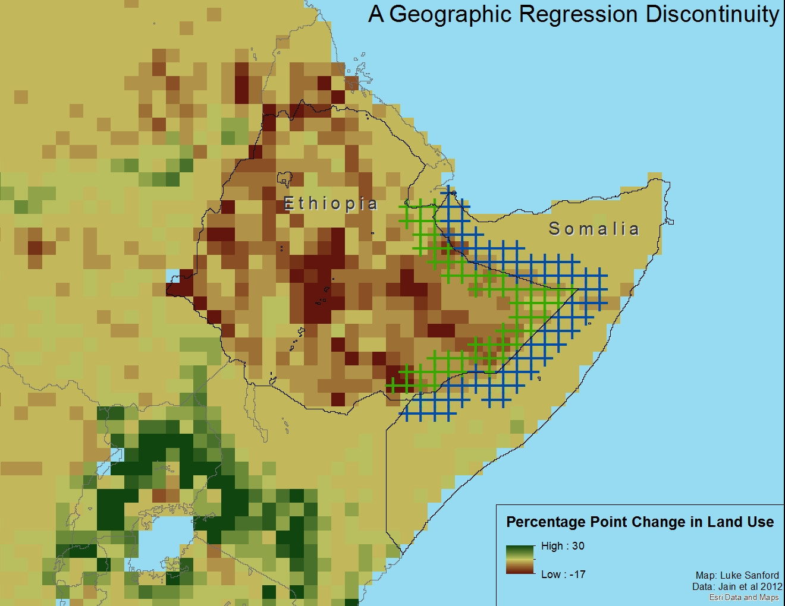
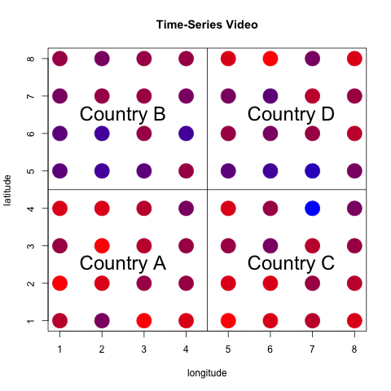

```{r setup, include=FALSE}
knitr::opts_chunk$set(echo = TRUE)
#setwd("~/Dropbox/Luke and Rachel/CI")
library(lfe)
library(animation)
```

We propose a geographic regression discontinuity approach to estimating the effect of a characteristic of a geographic unit (the electoral institutions of a country, for example) on a spatially distributed outcome (level of forest cover, for example). We use multiple borders over multiple time periods and show that keeping only data near the discontinuity can be more efficient than using all of the data.



# Introduction

There is not a great method for causal inference with spatial data. We are often interested in political variables that lead to a spatial outcome. For example, how do elections impact deforestation? Current methods- mainly regression discontinuity and matching- are insufficient. Geographic regression continuity is a young and limited method: it only covers one time period and one boundary. Here, we expand this method to include multiple borders and time-series. 


# Data Generating Process

We assign each cell a geographic location, denoted by its "latitude" and "longitude," and a country based on that cell's location. Each cell is then assigned a treatment level (between 1 and 4, based on country) and an outcome (in this case, 2 times the treatment plus some normally distributed noise). 
Colors show the outcome as a function of different treatment levels by country
The plots below show the full map, and then the data used to estimate the GRDD.

```{r, echo=FALSE,fig.height=7.5, fig.width=13}
#id of each point
id<-1:64
#x and y values
x<-rep(1:8,8)
y<-rep(1:8,each=8)
dat<-data.frame(id,x,y)
#country dummies
dat$a[dat$x<=4 & dat$y<=4]<-1
dat$b[dat$x<=4 & dat$y>4]<-1
dat$c[dat$x>4 & dat$y<=4]<-1
dat$d[dat$x>4 & dat$y>4]<-1
dat[is.na(dat)]<-0
#country treatments
dat$rhs[dat$a==1]<-1
dat$rhs[dat$b==1]<-2
dat$rhs[dat$c==1]<-3
dat$rhs[dat$d==1]<-4
#outcome variable, cross-sectional
dat$lhs<-dat$rhs*2+rnorm(n = 16,mean = 0,sd = .5)

##Map##

#Create a function to generate a continuous color palette
rbPal <- colorRampPalette(c('red','blue'))

#This adds a column of color values
# based on the y values
dat$Col <- rbPal(10)[as.numeric(cut(dat$lhs,breaks = 10))]

par(mfrow=c(1,2), oma=c(2,0,2,0))
plot(dat$x,dat$y,pch = 20,col = dat$Col, cex=4, xlab="longitude",ylab="latitude")
abline(h=4.5)
abline(v=4.5)
text(2.5,2.5,labels = "Country A", cex=2)
text(2.5,6.5,labels = "Country B", cex=2)
text(6.5,2.5,labels = "Country C", cex=2)
text(6.5,6.5,labels = "Country D", cex=2)

##do border RDD design##
rddat<-subset(dat,(4<=x & x<=5) | (4<=y & y<=5))
#look at new map
plot(rddat$x,rddat$y,pch = 20,col = rddat$Col, cex=4, xlab="longitude",ylab="latitude")
title(main="Trimming the Map for the Border",outer=TRUE,cex=5)
abline(h=4.5)
abline(v=4.5)
text(2.5,2.5,labels = "Country A", cex=2)
text(2.5,6.5,labels = "Country B", cex=2)
text(6.5,2.5,labels = "Country C", cex=2)
text(6.5,6.5,labels = "Country D", cex=2)
```

As expected, throwing out data leads to a less efficient estimate above. However, to simulate spatially autocorrelated noise, we add a shock in a randomly chosen cell that dissipates with the square of distance. In this case, the shock disproportionately affects Country D.
```{r,echo=FALSE,fig.height=7.5, fig.width=10}
#to get geographically diminishing perturbances, pick a random point,
#scale perturbance by distance from that point
set.seed(123)
locationx<-6
locationy<-6
size<-10
dat$influence<-size/(1+.05*sqrt((dat$x-locationx)^2+(dat$y-locationy)^2))
dat$lhs<-dat$lhs+dat$influence

dat$Col <- rbPal(10)[as.numeric(cut(dat$influence,breaks = 10))]

plot(dat$x,dat$y,pch = 20,col = dat$Col, cex=5, xlab="longitude", ylab = "latitude",main="Simulation with Shock")
abline(h=4.5)
abline(v=4.5)
text(2.5,2.5,labels = "Country A", cex=2)
text(2.5,6.5,labels = "Country B", cex=2)
text(6.5,2.5,labels = "Country C", cex=2)
text(6.5,6.5,labels = "Country D", cex=2)
grdd.est<-0
grdd.sd<-0
fe.est<-0
fe.sd<-0
for (i in 1:5000) {
  dat$lhs<-dat$rhs*5+rnorm(n = 16,mean = 0,sd = 2)
  locationx<-floor(runif(1,min = 1,max = 9))
  locationy<-floor(runif(1,min = 1,max = 9))
  size<-30
  dat$influence<-size/(1+.05*sqrt((dat$x-locationx)^2+(dat$y-locationy)^2))
  dat$lhs<-dat$lhs+dat$influence
  rddat<-subset(dat,(4<=x & x<=5) | (4<=y & y<=5))
  #compare regressions
  grdd.est[i]<-lm(rddat$lhs~rddat$rhs)$coefficients[[2]]
  #grdd.sd[i]<-coef(summary(lm(rddat$lhs~rddat$rhs)))[,2]
  fe.est[i]<-lm(dat$lhs~dat$rhs)$coefficients[[2]]
  #fe.sd[i]<-coef(summary(lm(dat$lhs~dat$rhs)))[,2]
}
dat$Col <- rbPal(10)[as.numeric(cut(dat$lhs,breaks = 10))]
```

# Findings
In the presence of a shock that is sufficiently large and sufficiently autocorrelated, an OLS estimate based on only the border cells is more efficient than an estimate that uses all of the data. The figure below shows that the distribution of the GRDD estimator has a smaller standard error than the usual OLS estimate. Both are centered on the true causal effect (5).
```{r,echo=FALSE,fig.height=7.5, fig.width=10}
#density plots
par(mfrow=c(1,1))
plot(density(grdd.est),main="Distribution of Estimators",xlab="Estimate")
lines(density(fe.est),col="red")
abline(v=5)
legend("topleft", c("Geographic RDD", "OLS"), col=c("black","red"),lty=c(1,1),bty="n")
```

# Introducing Time: Panel Data 
In addition to estimating on multiple discontinuities, we show that a GRDD can be more efficient than a within estimator in a panel setting. Each cell starts with a dependent variable value of 0, and in independent variable value of 5. Then, the independent variable in each country is assigned a random walk process, where the change in each round is -1, 0 or 1. The independent variable for each cell takes its value in the previous period, plus the treatment effect (one times the independent variable) plus the (randomly located) spatial shock from above and some noise. Below we show the outcome variable for each cell over 100 periods, with blue indicating higher values: 
```{r,include=FALSE,echo=FALSE,fig.height=10, fig.width=10}
#recreate the original data set
id<-1:64
year<-rep(1,64)
#x and y values
x<-rep(1:8,8)
y<-rep(1:8,each=8)
dat<-data.frame(id,year,x,y)
#country dummies
dat$a[dat$x<=4 & dat$y<=4]<-1
dat$b[dat$x<=4 & dat$y>4]<-1
dat$c[dat$x>4 & dat$y<=4]<-1
dat$d[dat$x>4 & dat$y>4]<-1
dat[is.na(dat)]<-0
#country treatments
dat$rhs<-5
dat$country[dat$a==1]<-"a"
dat$country[dat$b==1]<-"b"
dat$country[dat$c==1]<-"c"
dat$country[dat$d==1]<-"d"
#outcome variable, start at 100% forest
dat$lhs<-0

#make panel data with 30 time periods
dat0<-dat
dat0$influence<-0
varnames<-c(paste(rep("dat",101),0:100,sep = ""))
data<-list()
for (i in 1:100){
  stuff<-get(varnames[i])
  stuff$year<-i
  globe<-rep(rnorm(n=1,mean=1,sd=.5),64)
  ind<-rnorm(n=64,mean=1,sd=.5)
  locationx<-floor(runif(1,min = 1,max = 9))
  locationy<-floor(runif(1,min = 1,max = 9))
  stuff$rhs[stuff$a==1]<-stuff$rhs[stuff$a==1]+floor(runif(1,min = -1,max = 2))
  stuff$rhs[stuff$b==1]<-stuff$rhs[stuff$a==1]+floor(runif(1,min = -1,max = 2))
  stuff$rhs[stuff$c==1]<-stuff$rhs[stuff$a==1]+floor(runif(1,min = -1,max = 2))
  stuff$rhs[stuff$d==1]<-stuff$rhs[stuff$a==1]+floor(runif(1,min = -1,max = 2))
  size<-5
  stuff$influence<-size/(1+.5*sqrt((stuff$x-locationx)^2+(stuff$y-locationy)^2))
  #now starts at 0 and goes up instead of starts at 100 and goes down
  stuff$lhs<-stuff$lhs+globe+ind+stuff$influence+stuff$rhs
  data[[i]]<-stuff
  assign(paste("dat",i,sep = ""),stuff)
}
saveGIF({
  for(i in 1:100){
    data[[i]]$Col <- rbPal(10)[as.numeric(cut(data[[i]]$lhs,breaks = 10))]
    plot(data[[i]]$x,data[[i]]$y, pch = 20,col = data[[i]]$Col, ylab="latitude",xlab="longitude",cex=5,main="Time-Series Video")
    abline(h=4.5)
    abline(v=4.5)
    text(2.5,2.5,labels = "Country A", cex=2)
    text(2.5,6.5,labels = "Country B", cex=2)
    text(6.5,2.5,labels = "Country C", cex=2)
    text(6.5,6.5,labels = "Country D", cex=2)
  }
},interval = 0.14,movie.name = "animation.gif")
```



Below we plot the distribution of a two-way fixed effects estimator that uses the full sample against an estimator that uses only border cells (the GRDD estimator) to show that using only border cells produces a more efficient estimate. Both are centered on the true effect size (1).

  
```{r,echo=FALSE,fig.height=7.5, fig.width=10}
##############Panel Data Business##################
#recreate the original data set
set.seed(12)
id<-1:64
year<-rep(1,64)
#x and y values
x<-rep(1:8,8)
y<-rep(1:8,each=8)
dat<-data.frame(id,year,x,y)
#country dummies
dat$a[dat$x<=4 & dat$y<=4]<-1
dat$b[dat$x<=4 & dat$y>4]<-1
dat$c[dat$x>4 & dat$y<=4]<-1
dat$d[dat$x>4 & dat$y>4]<-1
dat[is.na(dat)]<-0
#country treatments
dat$rhs<-5
dat$country[dat$a==1]<-"a"
dat$country[dat$b==1]<-"b"
dat$country[dat$c==1]<-"c"
dat$country[dat$d==1]<-"d"
#outcome variable, start at 100% forest
dat$lhs<-0


#compare estimators
#summary(felm(fulldata$lhs~fulldata$rhs | fulldata$year + fulldata$country))

#summary(felm(rdfulldata$lhs~rdfulldata$rhs | rdfulldata$year + rdfulldata$country))

##scale up, run 500 simulations and compare coefficients
full<-0
rdd<-0
fullsd<-0
rddsd<-0

for (j in 1:500){
  dat0<-dat
  dat0$influence<-0
varnames<-c(paste(rep("dat",101),0:100,sep = ""))
data<-list()
for (i in 1:50){
  stuff<-get(varnames[i])
  stuff$year<-i
  globe<-rep(rnorm(n=1,mean=1,sd=.5),64)
  ind<-rnorm(n=64,mean=1,sd=.5)
  locationx<-floor(runif(1,min = 1,max = 9))
  locationy<-floor(runif(1,min = 1,max = 9))
  stuff$rhs[stuff$a==1]<-stuff$rhs[stuff$a==1]+floor(runif(1,min = -1,max = 2))
  stuff$rhs[stuff$b==1]<-stuff$rhs[stuff$a==1]+floor(runif(1,min = -1,max = 2))
  stuff$rhs[stuff$c==1]<-stuff$rhs[stuff$a==1]+floor(runif(1,min = -1,max = 2))
  stuff$rhs[stuff$d==1]<-stuff$rhs[stuff$a==1]+floor(runif(1,min = -1,max = 2))
  size<-50
  stuff$influence<-size/(1+.5*sqrt((stuff$x-locationx)^2+(stuff$y-locationy)^2))
  #now starts at 0 and goes up instead of starts at 100 and goes down
  stuff$lhs<-stuff$lhs+globe+ind+stuff$influence+stuff$rhs
  assign(paste("dat",i,sep = ""),stuff)
}
  
  # plot the results at the end
  # dat30$Col <- rbPal(10)[as.numeric(cut(dat30$lhs,breaks = 10))]
  # par(mfrow=c(1,1))
  # plot(dat30$x,dat30$y,pch = 20,col = dat30$Col, cex=3)
  # abline(h=4.5)
  # abline(v=4.5)
  
  #combine datasets
  fulldata<-dat0
  for (i in 1:50){
    stuff<-get(varnames[i])
    fulldata<-rbind(fulldata,stuff)
  }
  #install.packages("lfe")
  #library("lfe")
  #get rdd data
  rdfulldata<-subset(fulldata,(4<=x & x<=5) | (4<=y & y<=5))
  
  a<-summary(felm(fulldata$lhs~fulldata$rhs |fulldata$country+ fulldata$year))$coefficients
  full[j]<-a[1,1]
  fullsd[j]<-a[1,2]
  
  
  b<-summary(felm(rdfulldata$lhs~rdfulldata$rhs | rdfulldata$country + rdfulldata$year))$coefficients
  rdd[j]<-b[1,1]
  rddsd[j]<-b[1,2]
  
}
par(mfrow=c(1,1))
plot(density(rdd),main="Distribution of Estimators",xlab="Estimate")
lines(density(full),col="red")
abline(v=1)
legend("topleft", c("Geographic RDD", "Fixed Effects"), col=c("black","red"),lty=c(1,1),bty="n")
```

# Summary 
We have shown that considering only points near the border between two treatment areas, or the simplest form of a geographic regression discontinuity design, generates a more efficient estimate of a treatment effect in cross-sectional and panel settings, even after it throws out more than half of the data. We find this effect in both cross-sectional and panel settings with multiple discontinuities and multiple treatments.
So far we have only considered the efficiency of the estimator. In the future, we would like to generalize this research into settings where the usual OLS or panel methods are biased by the spatial autocorrelation of the data but where a geographic regression continuity design is still unbiased.
