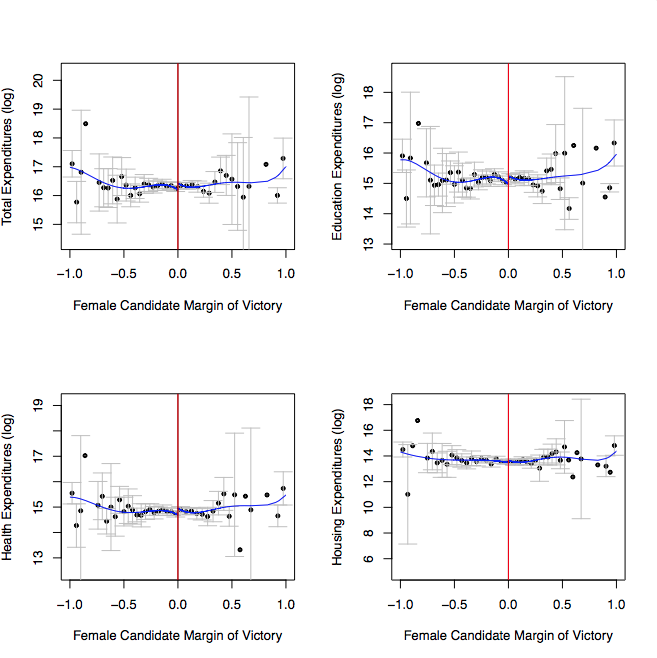
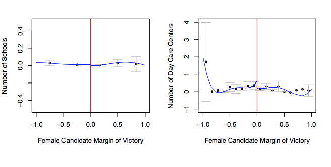
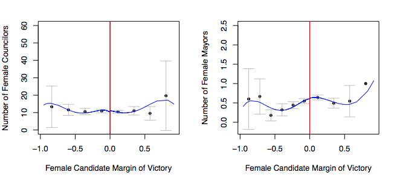

```{r setup, include=FALSE}
knitr::opts_chunk$set(echo = TRUE)
```

Do female politicians behave systematically different than male ones? Answering this question has direct implications for politics, public policy and social justice. Besides, we know that women are vastly underrepresented in most democracies. In the United States, for example, only 19\% of members of Congress are female. In Brazil, women represent less than 15% of different branches of government, including the Congress and state legislature seats. Worldwide, that number creeps up to 22\% -- still far from the 50\% that would be expected if male and female candidates were equally likely to be elected.

If representative democracy requires that voters delegate their powers to an elected official who will represent their preferences in government -- and if men and women have different preferences -- then most democracies are failing miserably at including women's points of view in their governing. But the if in the previous sentence is a big if. We know that women are more likely to [be liberal](http://www.journals.uchicago.edu/doi/abs/10.1086/250093), to [support the Democratic Party in the United States](https://academic.oup.com/qje/article-abstract/117/3/917/1933043/Why-Have-Women-Become-Left-Wing-The-Political), and to [favor](http://www.sciencedirect.com/science/article/pii/S0047272704000866]) [redistributive policies](http://onlinelibrary.wiley.com/doi/10.1162/1542476053295313/abstract) than men. Shouldn't they elect more women, then, to advance their political preferences? To answer that question, however, we need to know whether or not female politicians are indeed more likely to represent women's preferences than male ones. And, here, the evidence can be inconclusive, at best, and paradoxal, at worst.

The research so far can be broadly divided into two groups: those that found that, yes, female politicians are more likely to prioritize themes like [health](http://onlinelibrary.wiley.com/doi/10.1111/j.1540-5907.2006.00202.x/abstract) and [education](http://www.sciencedirect.com/science/article/pii/S0176268009000020), as well as implement policies that are of the interest of female constituencies, such as [clean water](http://onlinelibrary.wiley.com/doi/10.1111/j.1468-0262.2004.00539.x/abstract) in India, and less likely to be involved in [corruption](http://www.sciencedirect.com/science/article/pii/S0304387816300244); and those who found that men and women are [basically the same](http://www.journals.uchicago.edu/doi/abs/10.1086/533551) [once they get to government](http://www.nber.org/papers/w17671). So the debate is far from solved. 

Most of the positive results refer to India, which a well-stablished policy of reserving seats in local legislatures to women has permitted a causal identification of the consequences of having women in government (although the results both inside and outside India are also mixed). We thus wanted to look at another developing large democracy: Brazil.

Brazil offers an interesting example for several reasons: firstly -- and perhaps most importantly from a researcher's perspective --, it has reliable data about both electoral results and policy outcomes. Additionally, although the two countries have very different political and social systems, they are comparable on a few dimensions -- both are relatively poor, under a federalist system, with a known history of clientelism -- ie, buying political support with money or illegal services -- and have large, diverse populations. But, unlike India, Brazil does not reserve offices for female candidates. Additionaly, other studies have found that the presence of female politicians have decreased gender gaps in [candidacies](http://onlinelibrary.wiley.com/doi/10.1111/ecoj.12492/abstract) and have changed stereotypes about gender roles, [reducing bias against female candidates](https://academic.oup.com/qje/article/124/4/1497/1917190/Powerful-Women-Does-Exposure-Reduce-Bias). 

We wanted to measure if female majors have an effect on three political outcomes: (1) budget expenditures on education and health; (2) local public good provision, such as schools and day care centers in their municipalities' and (3) encouraging other women to run for local offices in subsequent elections (mayor or municipal counselor). So that we can attribute causation -- ie, we can confidently say that it is the major's gender that is driving these outcomes --, we looked exclusively at municipalities where only one male and one female candidate ran for the city hall in the previous election, and then only at close races. The idea, here, is that if a candidate lost by, say, 0.5 of a percentage point, then the result of the election was basically random. So, on average, the two groups of municipalities --those that elected female majors and those which elected male ones -- are comparable. To ensure that whatever results we found were not specific to a single election, we included data from 2000 to 2015, spamming four municipal elections in Brazil.

Our findings, as shown in the figures below, indicate that male and female candidates are not systematically different on the three dimensions we examined. But, although our research design allows us to attribute causation, care is needed when interpreting the results: we can only claim that male and female candidates are equivalent for those tight elections. It could well be that females who win by bigger margins are substantively different from those in tossup races.









Our results do not, obviously, settle the debate -- far from it: we hope that it will feed it. But we hope that they will elucidate under what conditions a politician's gender makes a difference. Several possibilities arise: perhaps female candidates on close races are forced to mask their true preferences to get elected; perhaps being elected under quotas -- as in India -- creates an incentive to behave more according to one's minority status; or, perhaps, specific conditions in Brazil -- such as the prevalence of political dynasties -- undermine gender preferences. Thus, the answer to this question might be related to political selection, i.e. who are the women running for office and why they do it. Future research should attempt to answer these questions. Our contribution is to show that a politician's gender, alone, does not always suffice to ensure female political representation.


